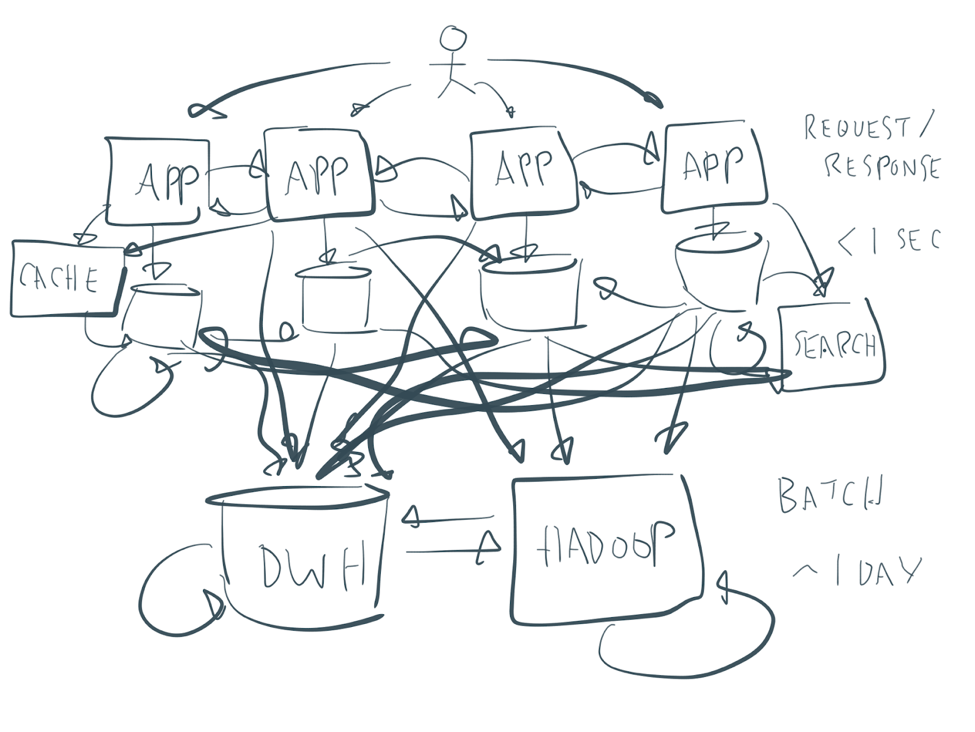

# adidas Asynchronous API guidelines

## Basic concepts about asynchronous APIs

### Event-driven architectures

#### What is an event-driven architecture

Event-Driven Architectures (EDAs) are a paradigm that promotes the production, consumption and reaction to events.

This architectural pattern may be applied by the design and implementation of applications and systems that transmit events amongst loosely coupled software components and services. 

An event-driven system typically consists of event emitters (or agents), event consumers (or sinks), and event channels.

- Producers (or publishers) are responsible for detecting, gathering and transferring events
    - Are not aware of consumers
    - Are not aware of how the events are consumed
- Consumers (or subscribers) react to the events as soon as they are produced
    - The reaction can be self-contained or it can be a composition of processes or components
- Event channels are conduits in which events are transmited from emitters to consumers

**Note** Producer and Consumer role is not exclusive. In other words, the same client or application can be producer and consumer at the same time.

In most cases, EDAs are broker-centric, as seen in the diagram below. 

*The figure above was taken from AsyncAPI official documentation*

#### Problem statement

Typically, the architectural landscape of a big company grows in complexity and as a result of that it is possible to end up with a bunch of direct connections between a myriad of different components or modules.

By using streaming patterns, it is possible to get a much cleaner architecture

It is important to take into account that EDAs are not a silver bullet, and there are situations in which this kind of architectures might not fit very well. 

One example is systems that heavily rely on transactional operations... of course it might be possible to use EDA but most probably the complexity of the resulting architecture would be too high.

Also, it is important to note that it is possible to mix request-driven and event-driven protocols in the same system. For example,

- Online services that interact directly with a user fits better into the synchronous communication but they also can generate events into Kafka.
- On the other hand, offline services (billing, fulfillment, etc) are typically built purely with events.

#### Kafka as the heart of EDAs

There are several technologies to implement event-driven architectures, but this section is going to focus on the predominant technology on this subject : Apache Kafka.

**Apache Kafka** can be considered as a Streaming Platform which relies on the several concepts:

- Super high-performance, scalable, highly-available cluster of brokers
    - Availability
        - Replication of partitions across different brokers
    - Scalability
        - Partitions
        - Ability to rebalance partitions across consumers automatically when adding/removing them
    - Performance
        - Partitioned, replayable log (collection of messages appended sequentially to a file)
        - Data copied directly from disk buffer to network buffer (zero copy) without even being imported to the JVM
        - Extreme throughput by using the concept of consumer group
    - Security
        - Secure encrypted connections using TLS client certificates
        - Multi-tenant management through quotas/acls
    - Client APIs on different programming languages : Go, Scala, Python, REST, JAVA, ...
    - Stream processing APIs like Kafka Streams
    - Ecosystem of connectors to pull/push data from/to Kafka
    - Clean-up processes for storage optimization
        - Retention periods
        - Compacted topics