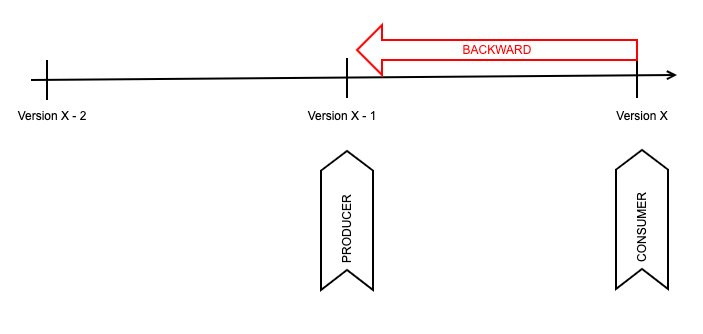
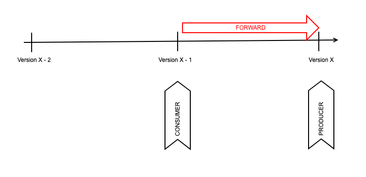
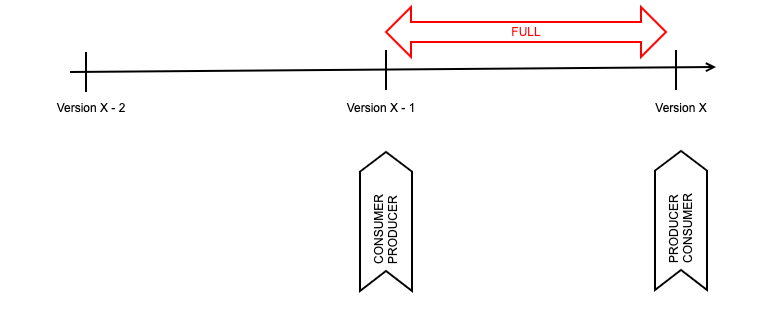

# adidas Asynchronous API guidelines

## Asynchronous API guidelines

### Schemas and data evolution

All asynchronous APIs **SHOULD** leverage Schema Registry to ensure consistency across consumers/producers with regards to message structure and ensuring compatibility across different versions. 

The default compatibility mode in Schema Registry is FULL_TRANSITIVE. This is the more restrictive compatibility mode, but others are also available. More on this on the subsection below.

 #### Compatibility modes

Once a given schema is defined, it is unavoidable that the schema evolves with time. Everytime this happens, downstream consumers need to be able to handle data with both old and new schemas seamlessly.

Each new schema version is validated according to the configuration before being created as a new version. Namely, it is checked against the configured compatibility types (see below).

**Important** The mere fact of enabling Schema Registry is not enough to ensure that there are no compatibility issues in a given integration. The right compatibility mode needs also to be selected and enforced.

As a summary, the available compatibility types are listed below:

| Mode | Description |
|------|-------------|
|BACKWARD|new schema versions are backward compatible with older versions|
|BACKWARD_TRANSITIVE|backward compatibility across all schema versions, not just the latest one.|
|FORWARD|new schema versions are compatible with older consumer versions|
|FORWARD_TRANSITIVE|forward compatibility across all schema versions.|
|FULL|both backward and forward compatibility with the latest schema version|
|FULL_TRANSITIVE|both backward and forward compatibility with all schema versions|
|NONE|schema compatibility checks are disabled|

#### Backward compatibility

There are two variants here:

- BACKWARD - Consumers using a new version (X) of a schema can read data produced by the previous version (X - 1)
- BACKWARD_TRANSITIVE - Consumers using a new version (X) of a schema can read data produced by any previous version (X - 1, X - 2, ....)

The operations that preserve backward compatibility are:

- Delete fields
    - Consumers with the newer version will just ignore the non-existing fields
- Add optional fields (with default values)
    - Consumers will set the default value for the missing fields in their schema version

#### Forward compatibility

Also two variants here:

- FORWARD - Consumers with previous version of the schema (X - 1) can read data produced by Producers with a new schema version (X)
- FORWARD_TRANSITIVE - Consumers with any previous version of the schema (X - 1, X - 2, ...) can read data produced by Producers with a new schema version (X)

The operations that preserve forward compatibility are:

- Adding a new field
    - Consumers will ignore the fields that are not defined in their schema version
- Delete optional fields (with default values)
    - Consumers will use the default value for the missing fields defined in their schema version

 
#### Full compatibility
 
This is a combination of both compatibility types (backward and forward). It also has 2 variants:

- FULL - Backward and forward compatible between schemas X and X - 1.
- FULL_TRANSITIVE - Backward and forward compatible between schemas X and all previous ones (X - 1, X - 2, ...)

**Important** FULL_TRANSITIVE is the default compatibility mode in FDP, it is set at cluster level and all new schemas will inherit it

This mode is preserved only if using the following operations

- Adding optional fields (with default values)
- Delete optional fields (with default values)

#### Upgrading process of clients based on compatibility 

Depending on the compatibility mode, the process of upgrading producers/consumers will be different based on the compatibility mode enabled.

- NONE
    - As there are no compatibility checks, no order will grant a smooth transition
    - In most of the cases this lead to having to create a new topic for this evolution
- BACKWARD / BACKWARD_TRANSITIVE
    - Consumers **MUST** be upgraded first before producing new data
    - No forward compatibility, meaning that there's no guarantee that the consumers with older schemas are going to be able to read data produced with a new version
- FORWARD / FORWARD_TRANSITIVE
    - Producers **MUST** be upgraded first and then after ensuring that no older data is present, upgrade the consumers
    - No backward compatibility, meaning that there's no guarantee that the consumers with newer schemas are going to be able to read data produced with an older version
-  FULL / FULL TRANSITIVE
    - No restrictions on the order, anything will work

 #### How to deal with breaking changes

If for any reason you need to use a less strict compatibility mode in a topic, or you can't avoid breaking changes in a given situation, the compatibility mode **SHOULD NOT** be modified on the same topic. 

Instead, a new topic **SHOULD** be used to avoid unexpected behaviors or broken integrations. This allows a smooth transitioning from clients to the definitive topic, and once all clients are migrated the original one can be decommissioned.

Alternatively, instead of modifying existing fields it **MAY** be considered as an suboptimal approach to add the changes in new fields and have both coexisting. Take into account that this pollutes your topic and it can cause some confusion. 